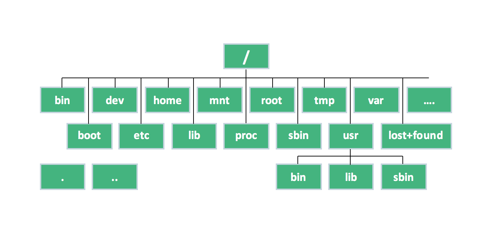

# FILE SYSTEM

Linux sử dụng hệ thống tệp phân cấp dưới dạng cây (tree) với một nút gốc (/) là nơi băt đầu của toàn bộ hệ thống hay nút này chứa toàn bộ các file và thư mục của hệ thống.

Dưới đây là cấu trúc file hệ thống trong linux:

## (/) Root directory
Đây là thư mục gốc của hệ thống, là điểm khởi đầu của toàn bộ hệ thống tệp hay nói cách khác đây là thư mục chứa toàn bộ hệ điều hành của bạn.

## (bin) binary directory
Đây là thư lục chứa các file thực thi, thường chứa các lệnh terminal, các tiện ích cốt lõi của hệ thông, ví vụ như: `cd` (change directory), `pwd` (print working directory ), `mv` (di chuyển) .v.v.